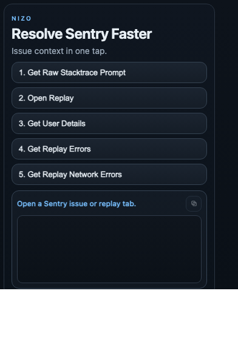

# Nizo

Nizo is a Chrome extension to speed up Sentry issue triage from issue and replay pages.


## Screenshot



## Features

1. `Get Raw Stacktrace Prompt`
   - Reads stack trace from the loaded issue page (DOM-first).
   - Builds a GPT/Codex-ready debugging prompt.
   - Copies prompt directly to clipboard.
2. `Open Replay`
   - Resolves replay from issue page (`See Full Replay` / `See All Replays` links and fallbacks).
   - Opens replay in a new tab.
3. `Get User Details`
   - Extracts user identity and runtime context from latest issue event.
4. `Get Replay Errors`
   - Extracts replay errors from replay DOM.
   - Returns event IDs, issue keys, and links (`eventUrl`, `issueUrl`) when available.
5. `Get Replay Network Errors`
   - Extracts failed/error network requests from replay `Network` tab.
   - Uses DOM and fallback parsing paths.
6. Response utilities
   - Built-in copy icon in popup response panel to copy JSON output.

## Tech Stack

- Manifest V3
- TypeScript (`tsc`)
- Content script + popup UI
- Zero backend required (uses logged-in Sentry browser session)

## Project Scripts

1. Install deps:
   ```bash
   npm install
   ```
2. Build extension:
   ```bash
   ./build.sh
   ```
3. Build + run Chrome/Chromium with extension preloaded:
   ```bash
   ./run.sh
   ```

## Load Extension

1. Open `chrome://extensions`
2. Enable Developer mode
3. Click `Load unpacked`
4. Select:
   ```text
   /Users/asif/development/experiments/nizo/dist
   ```

## Quick Verification

1. Open a Sentry issue page.
2. Click Nizo in Chrome toolbar.
3. Run all actions in order:
   1. `Get Raw Stacktrace Prompt`
   2. `Open Replay`
   3. `Get User Details`
   4. `Get Replay Errors`
   5. `Get Replay Network Errors`
4. Use copy icon in response panel to copy output for sharing/debugging.

## Notes

- Supported hosts: `sentry.io`, `*.sentry.io`, and compatible Sentry domains.
- If a page was open before extension load, Nizo auto-injects the content script on first action.
- Some replay data extraction relies on what is rendered in the current replay view.
